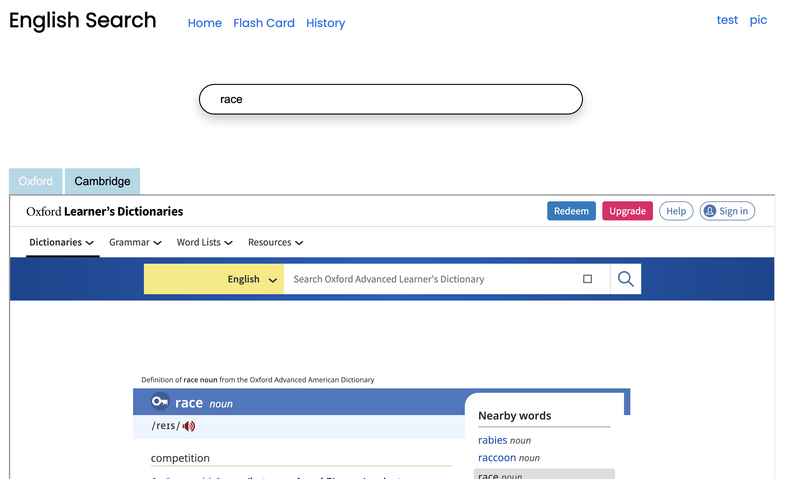

<p align="center" width="100%">
     
</p>

# English Search Web:

<p align="center" width="100%">
     
</p>

# How to build:

```
npm run build
```

# How to run server:

```
npm run server
```

# Features:
* Search English word and show result on 3 website: Oxford, Cambrigde, Google Translate (work on IOS)
* Flash Card
* Save your history seached word

# JavaScript runtime environment:
* Nodejs

# Module bundler:
Webpack
  
# Libraries:
* @types/jquery@3.5.16
* @types/jqueryui@1.12.16
* axios@1.2.2
* css-loader@6.7.3
* express@4.18.2
* html-webpack-plugin@5.5.0
* style-loader@3.3.1
* ts-loader@9.4.2
* typescript@4.9.4
* webpack-cli@5.0.1
* webpack-dev-middleware@6.0.1
* webpack-dev-server@4.11.1
* webpack@5.75.0

# Data English word from:
* 446k words: https://github.com/dwyl/english-words
* 10k google words: https://github.com/first20hours/google-10000-english

# This App have 3 versions on 3 devices:
* [IOS app](https://github.com/vitiennam/EngS)
* [Android app](https://github.com/vitiennam/EngSAndroid)
* [Website](https://github.com/vitiennam/EngSWeb)
* [Website using webpack and typeSrcipt](https://github.com/vitiennam/EngSTS)